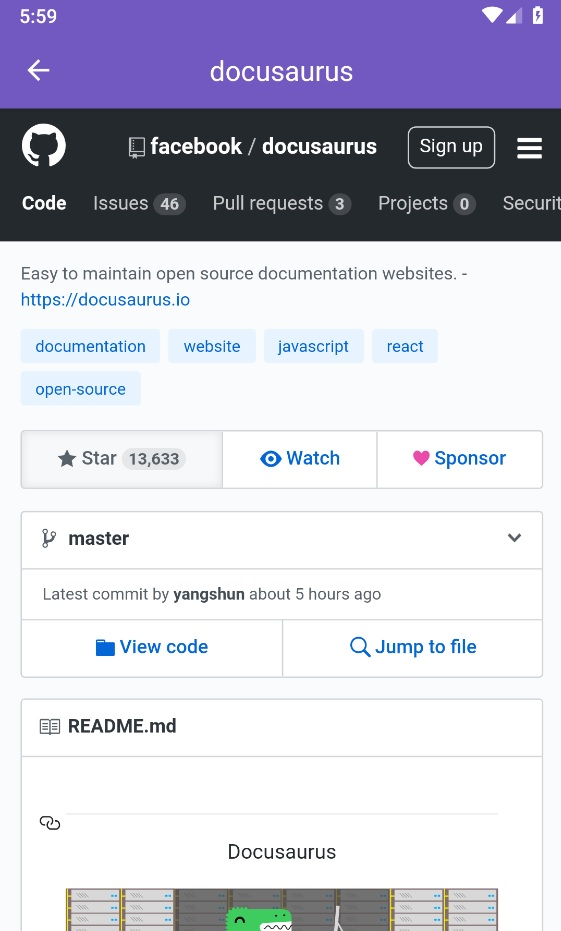

# Favorite Github users

A mobile app made with react-native to manage a list of favorite users and allow to browse in tis starred repos.

**Note:** this was tested only on Android. Don't know if it will work properly on IOs.

# Features

## Add your favorite users to a listing
This will store the users in the device storage.


## Browse your favorite user starred repos
See all the repos that your favorite user follows having pull-to-refresh and inifinte scrolling features.


## Check a starred repo page
Open the repo page in the integrated Webview in the app.


# Quick start

1. Clone the repo
````sh
git clone git@github.com:Artenes/rocketseat-bootcamp-githubusers.git
````

2. Enter in directory
````sh
cd rocketseat-bootcamp-githubusers.git
````

3. Install dependecies
````sh
yarn
````

4. Have an Android emulator running or device connect via USB.

5. If working with android redirect tcp ports (this app is configured with [reactotron](https://github.com/infinitered/reactotron))
````sh
adb reverse tcp:9090 tcp:9090
````

6. Start application
````sh
npx react-native run-android
````

In consecutive calls just run
````sh
npx react-native start
````

And in any case where an nonsen error message appears, close the app in the device and run
````sh
npx react-native start --reset-cache
````
# Known issues

## Autolinkning error message

When running the application, the following log will be shown

```
error React Native CLI uses autolinking for native dependencies, but the following modules are linked manually:
  - react-native-vector-icons (to unlink run: "react-native unlink react-native-vector-icons")
This is likely happening when upgrading React Native from below 0.60 to 0.60 or above. Going forward, you can unlink this dependency via "react-native unlink <dependency>" and it will be included in your app automatically. If a library isn't compatible with autolinking, disregard this message and notify the library maintainers.
Read more about autolinking: https://github.com/react-native-community/cli/blob/master/docs/autolinking.md
```

This is more of a warning than an error. This happens because we use `react-native-vector-icons` for some icons used in the application. But the application compiles and runs normally, so just ignore this message.
